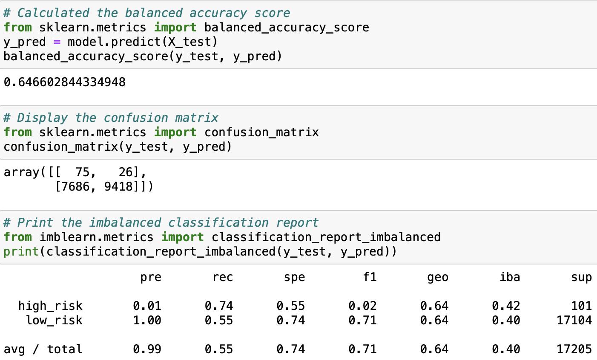
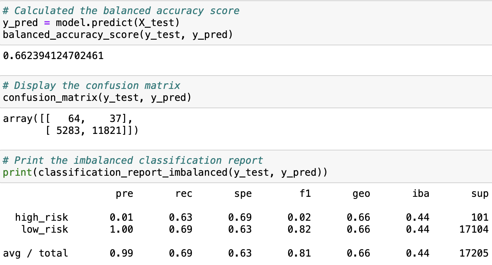
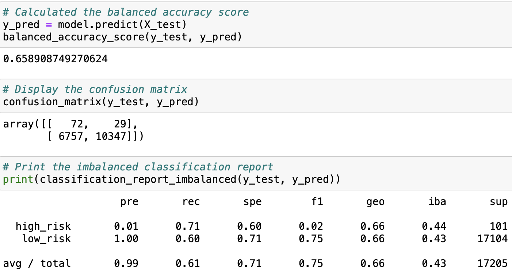
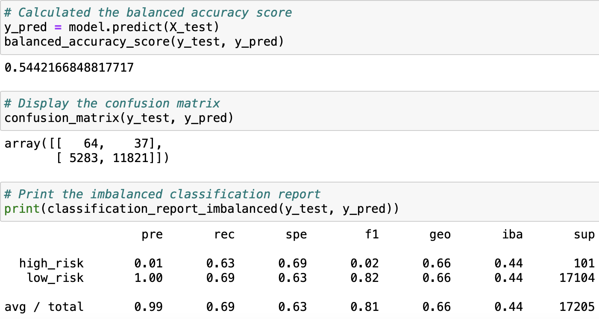
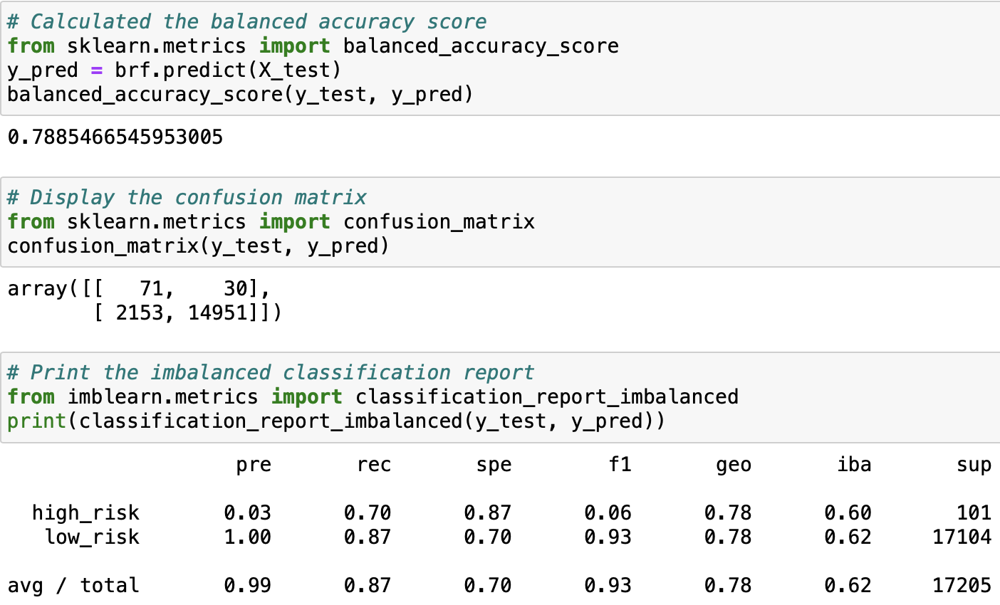
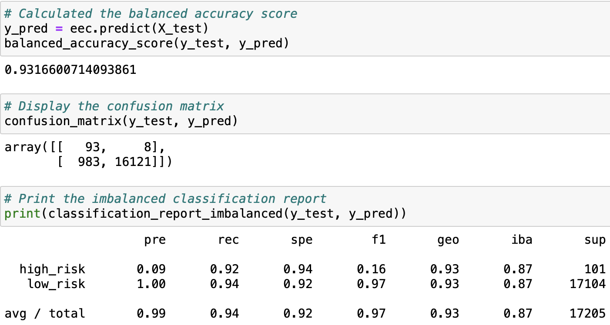

# Credit_Risk_Analysis

## Analysis Overview
The scope of this analysis covers a variety of ML models to predict whether a loan applicant is at high or low risk of defaulting on thier debts. The analysis utilizes a combination of over- and under-sampling methods *RandomOverSampler, SMOTE, CluserCentroids* and the combined *SMOTEEN* before using **SKLearn's** LogisticRegression model to predict risk level from more than 80 features. These methods are compared to two **imblearn** ensemble classifiers *BalancedRandomForest* and *EasyEnsemble*.

### Constraints
- 85 Factors, 1 target variable (risk level)
- Highly Imbalanced:
  - 68,470 'low_risk' data points
  - 347 'high_risk' data points

## Results
In the table below, the reports for the six ML models are depicted including: their balanced accuracy scores, precision and recall scores, confusion matrix, and classification report (with F1 score).  

<table style='width: 100px'>
  <tr>
    <th>Random Oversampling</th>
    <th>Synthetic Minority Oversampling Technique (SMOTE)</th>
    <th>SMOTE + Edited Nearest Neighbors (SMOTEENN)</th>
  </tr>
  <tr>
    <td> </td>
    <td> </td>
    <td> </td>
  </tr>
  <tr>
    <th>Cluster Centroids</th>
    <th>Balanced Random Forest</th>
    <th>Easy Ensemble Classifier</th>
  </tr>
  <tr>
    <td> </td>
    <td> </td>
    <td> </td>
  </tr>
</table>